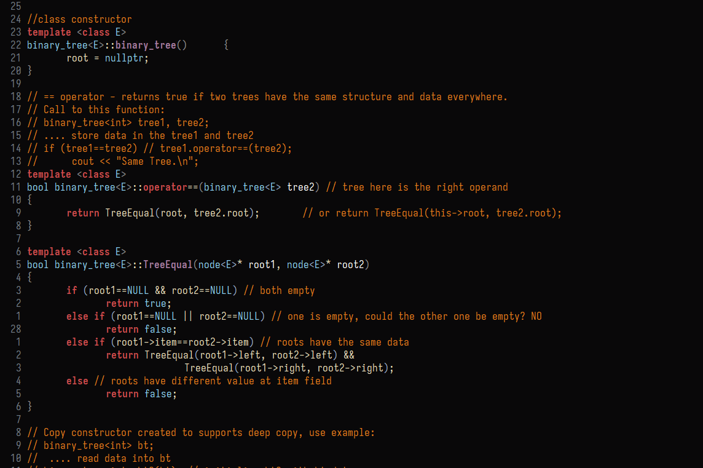
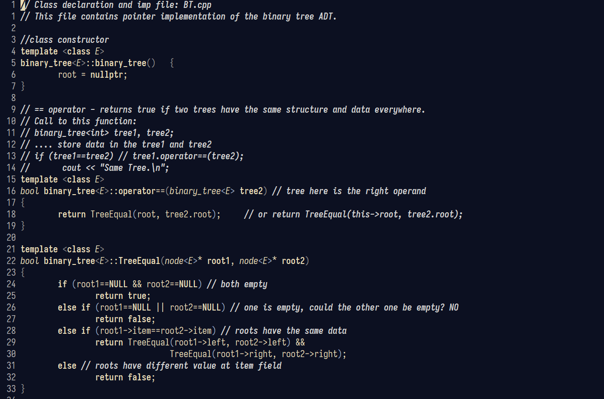

# Emacs-Config
This Repository currently has the dotfiles for my Emacs that I use on my Desktop, but can easily be transferred over to other work-stations.

I have included two custom themes that I have created called Zugg Dark and Monochrome Blackboard

## Zugg Dark

## Monochrome Blackboard

